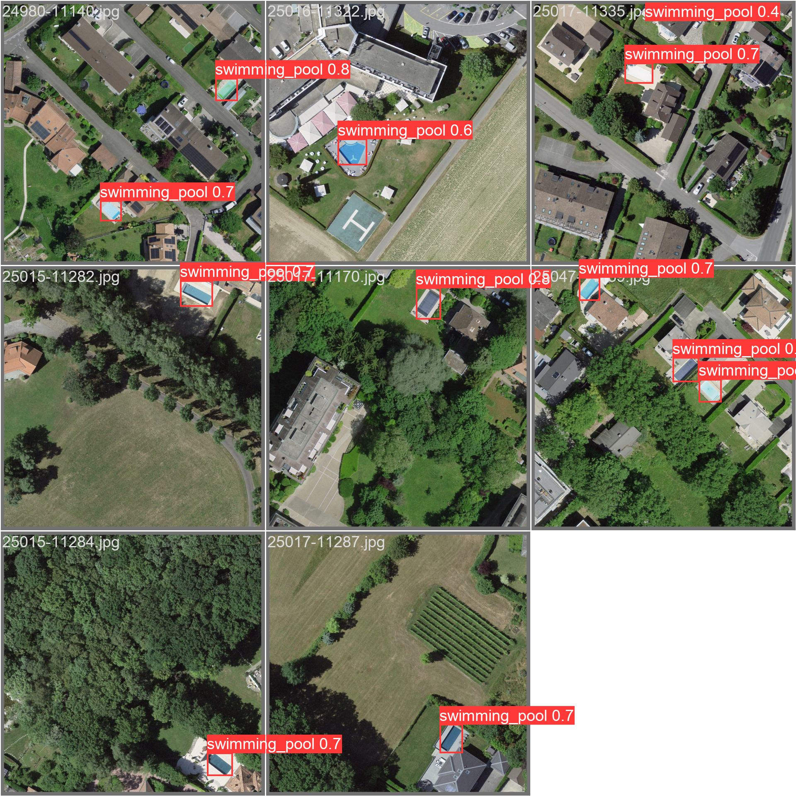

# fedpool

Détection et localisation automatique de piscines sur la base d'images aériennes de *swisstopo*.

_À l'exception du dossier `presentation`, les images du dépôt sont issues de [SWISSIMAGE 10 cm](https://www.swisstopo.admin.ch/fr/orthophotos-swissimage-10-cm) et sont © swisstopo._

### Intro

À l'aide du modèle _fedpool_ basé sur l'architecture _YOLOv5m_, il est possible de détecter les piscines sur les images aériennes de _swisstopo_, l'Office fédéral de topographie. Le modèle ayant été entraîné sur un nombre relativement restreint de données, il ne gère pas de façon optimale la grande diversité des piscines visibles depuis les airs. En effet, en plus des piscines "classiques" bleues, il y en a des couvertes (verrière), bâchées (en bleu foncé, blanc, gris, etc.), des non traitées de couleur verte ainsi que des formes plus ou moins originales et des tailles variées.

Toutefois, le _pipeline_ (ou presque) permet de reproduire l'ensemble des étapes afin de pouvoir également entraîner un modèle afin d'obtenir des (meilleures) prédictions.

### Organisation

Le repo est organisé en plusieurs dossiers :

- `/dev_notebooks` contient les différents scripts utilisés aux formats Quarto et Jupyter notebooks, numérotés selon leur enchaînement :
  - 00_restrictions_zones : Script pour cibler des zones avec une plus forte densité de piscines, afin de limiter les images à télécharger et la fouille d'image à labéliser.
  - 01_recup_imgs : Utilise les boundings boxes géographiques issues de `00` pour télécharger les images aériennes les plus récentes dans ces zones
  - 02_traitement_images : Découpage des images issues de `01` et nommage selon les coordonnées suisses
  - 03_annotations_images : L'annotation a été faite sur une sélection (aléatoire, mais orientée piscines) d'images issues de `02` avec [Label Studio](https://labelstud.io/), post-traitement pour les renommer avec python. Elles se trouvent dans `/data/annotations`
  - 04_entrainement_modele : Le modèle a été entraîné avec PyTorch sur les images annotées en `03`, à l'aide du repo [yolov5](https://github.com/ultralytics/yolov5). Les poids et autres métriques se trouvent dans `/fedpool_model`
  - 05_predictions_images : Les prédictions des images sont effectuées à l'aide du modèle entraîné en `04` et les bounding boxes converties pour obtenir des coordonnées (pas de tri ou d'infos sur la confiance, mais rajoutable ici)
  - 06_conversion_geometries : Les boundings_boxes isues de `05` sont transformées en couches géo et exportées en coordonnées suisses (EPSG:2056) et WGS84 (4326)
- `/data` contient les diverses données issues ou nécessaires pour les scripts (les éléments intermédiaires n'ont pas été joints en raison de leur taille) :
  - `/annotations` contient les images annotées et leurs labels
  - `bounding_boxes.json` contient les bbox géographiques des ensembles d'images ciblées dans `00`
  - `detected_pools.` contient les piscines détectées par le modèle (formats .csv et .gpkg en coordonnées suisses et .kml et .geojson en WGS84)
- `/fedpool_model` contient les poids et métriques associées à l'entraînement du modèle
- `/presentation` contient la présentation du séminaire au format .html

### Remarques

Le modèle a une bonne marge de progression et il serait intéressant de tester différentes tailles d'images ainsi que de donner des exemples sans annotation avec des éléments proches (court de tennis bleus, toile de tente, etc.). La variation et l'augmentation du nombre d'exemples pour l'entraînement permettrait sûrement de rendre le modèle plus robuste et il serait également intéressant de voir si les architectures plus grandes (yolov5l et x) donneraient également de meilleurs résultats.

### Contexte de développement

Ce projet a été développé dans le cadre du cours _Introduction au traitement d'image_ (SP24) dispensé par Aris Xanthos (SLI, Lettres, UNIL).